# Online School Management System

## Table of contents

* [Introduction](#introduction)

* [Features](#features)

* [Technologies](#technologies)

* [Demo Screenshots](#demo-screenshots)

* [Setup](#setup)

## Introduction

An online school management system is a website that is designed to streamline the paperless administration of schools and educational institutions. It consists of various modules that greatly help the teachers and staff to maintain student records, academic history, and other essential student information. This was a group project built for an undergraduate academic course.

## Features

This school website has four users:

1. Teacher:

  * Download his schedule/routine
  
  * Search attendance by date(taken by him)
  
  * Search result by subject

  * View all the attendances taken by him
  
2. Student:

  * Download his class routine
  
  * Search his attendance by date
  
  * View all his attendance
  
  * View his result
  
3. Guardian:

  * Download his/her children class routine
  
  * View his/her children attendance, result
  
  * Give review about school
  
4. Admin:

  * Create account for teachers, students and guardians
  
  * Add teachers and students routine
  
  * Add results, attendance records
  
  * Add news/events
  
  ## Technologies
  * ASP.NET MVC
  * HTML
  * Javascript
  * CSS
  * SCSS
  * C#
  * Microsoft SQL Server
  * Microsoft Visual Studio
  
  ## Demo Screenshots
  

 
 
  <h3> Home Page  </h3>

 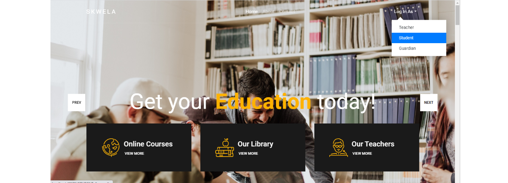

 

  <h3>Logging in as a student </h3>
  
 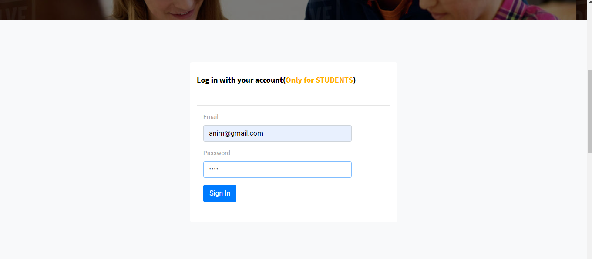
 
 

 

  <h3> Features available to the students  </h3>
  
 
 
 

  <h3> Attendance record of a student  </h3>
  
 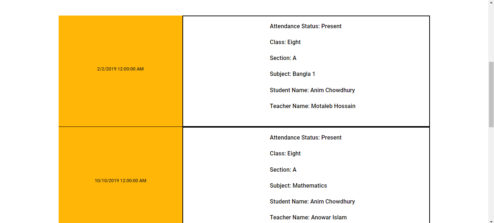
 
 

  <h3> Exam Result of a student  </h3>
  
 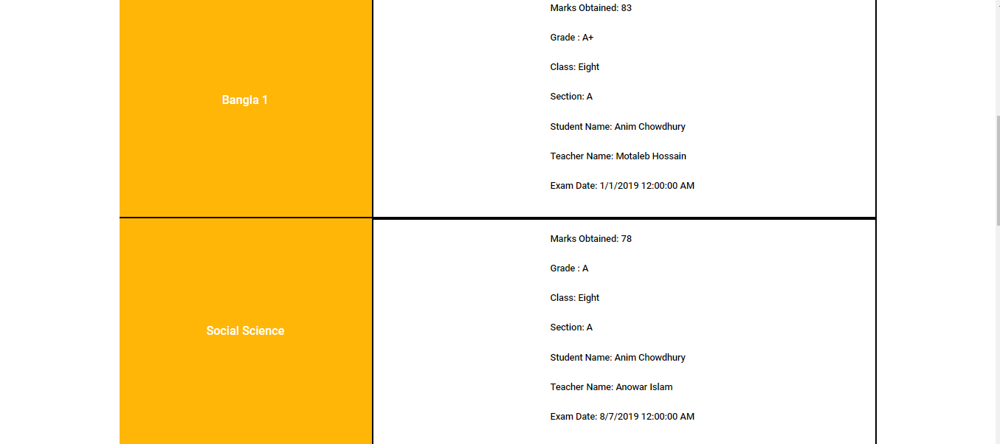
 
 

  <h3> Student can download his/her respective class routine   </h3>
  
 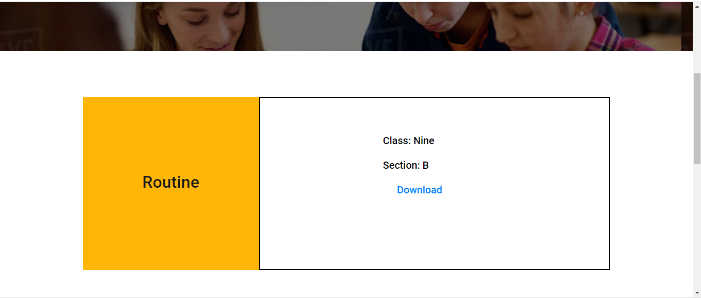
 
 

  <h3> Student's profile  </h3>
  
 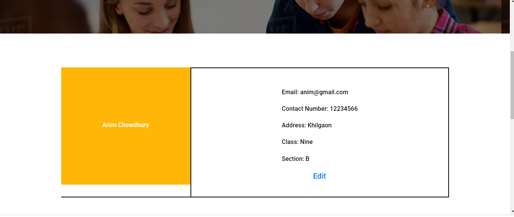
 
 

  <h3> Student can search exam result by subject and attendance by date  </h3>
  
 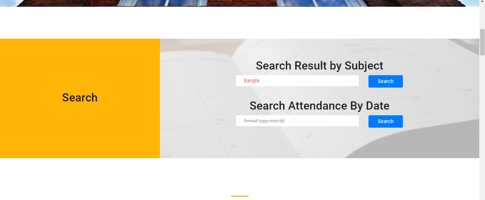
 
 

  <h3> Result of searching exam result by subject (Bangla)   </h3>
  
 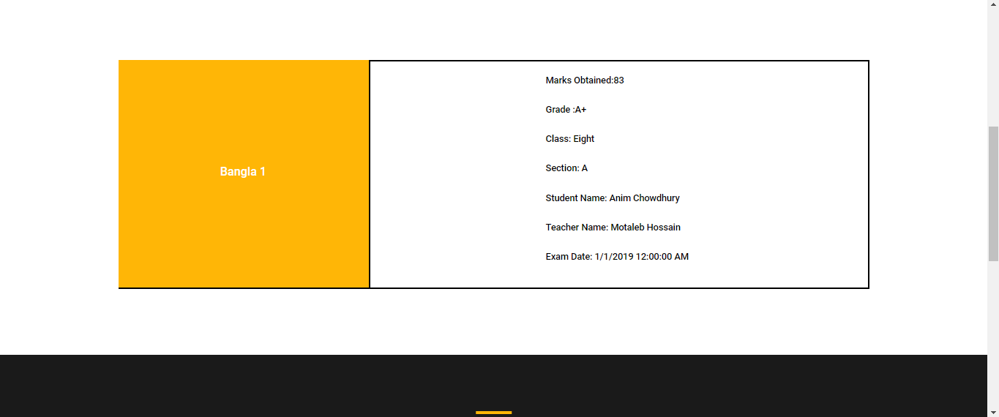
 
 

  <h3> Result of searching attendance by date (3-1-2019)  </h3>
  
  <h3> Similiar convenient features are availble to the teachers as well </h3>
  
 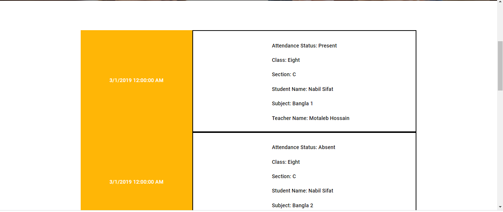
 
 

  <h3> Features available to the guardians </h3>
  
 
 
 

  <h3> Guardians can view their child's exam results  </h3>
  
 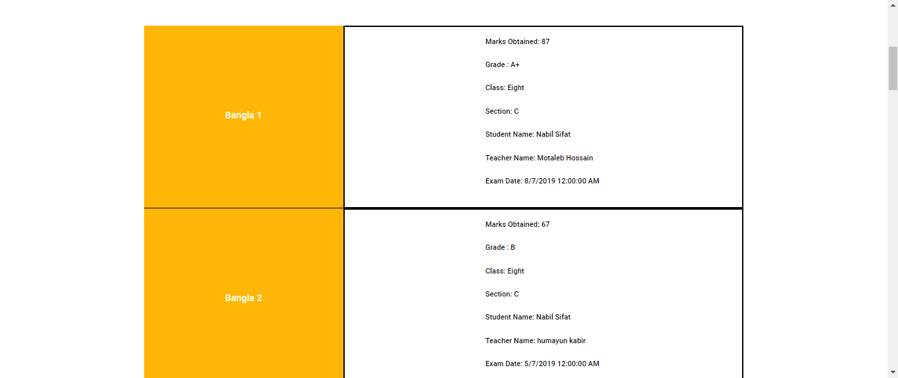
 
 

  <h3> Guardians can view their child's attendance record  </h3>
  
 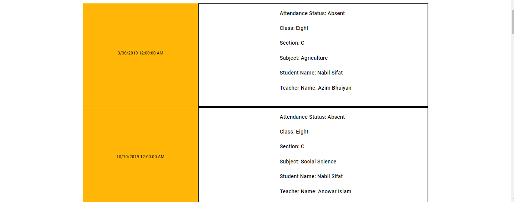
 
 

 
 ## Setup
 
It is better to use Microsoft Visual Studio IDE (Integrated Development Environment) to run this project properly. The 'OnlineSchool.sln' file should be opened with the IDE to  built the project and to run it.
